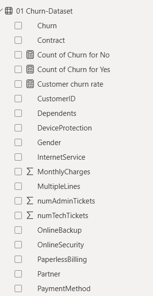
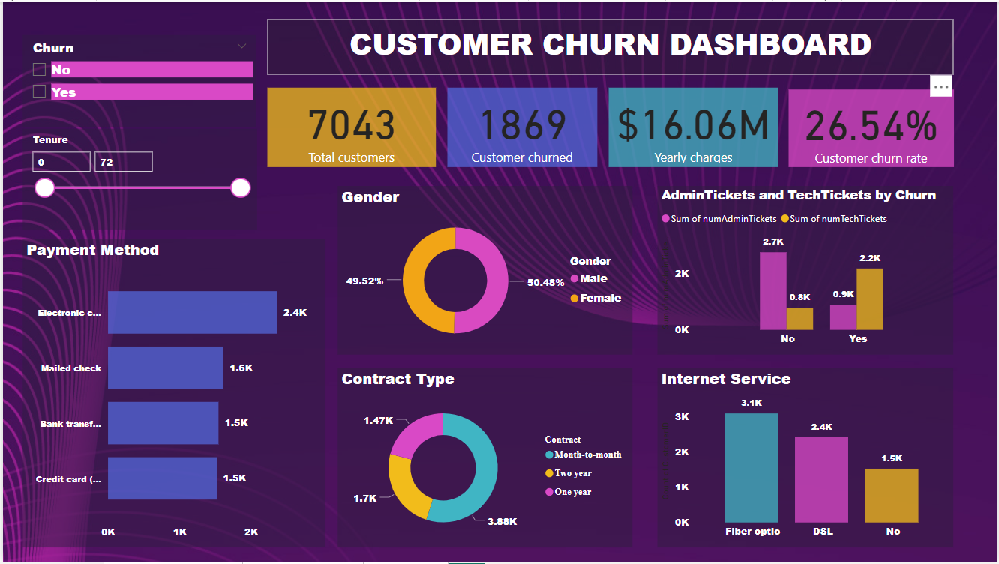
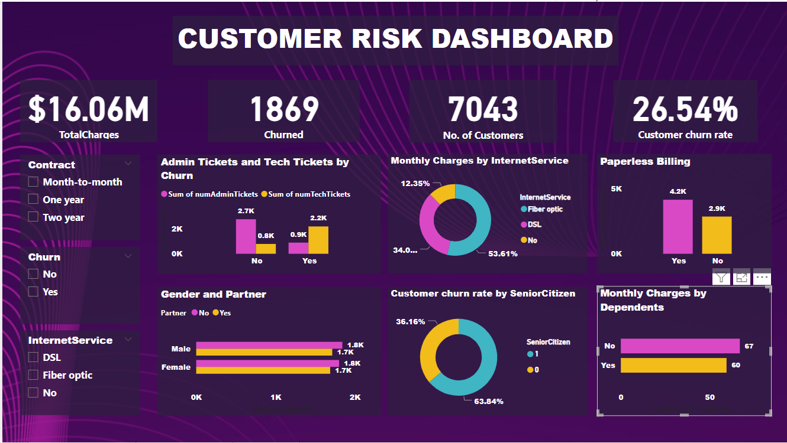
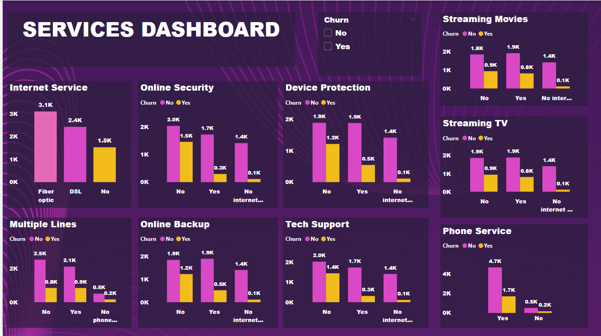

# PWC-CHURN-DATASET
The PwC Churn Dataset is a popular dataset used for customer churn analysis, often in the context of telecommunications or subscription-based businesses. It contains information about customers, their usage patterns, and whether they have churned (stopped using the service).

# Problem Statement :
The purpose of this task is to:

- Define proper KPI's
- Create a dashboard for the retention manager reflecting the KPI's
- Write a short email to him (the engagement partner) explaining your findings, and include suggestions as to what needs to be changed

# Datasource :
Dataset used for this task was presented by [Pwc](heforage.com/virtual-experience/a87GpgE6tiku7q3gu/pw-c-switzerland/power-bi-cqxg/customer-retention) and customer churn Retention 

Dataset: [Customer Churn Retention](https://cdn.theforage.com/vinternships/companyassets/4sLyCPgmsy8DA6Dh3/02%20Churn-Dataset.xlsx)

# Data Preparation
The Data transformation was completed in Power Query and the dataset loaded into Microsoft Power BI Desktop for modeling.

- The dataset named Diversity and inclusion dataset has 500 rows and 31 column of observation
- Removed Unnecessary columns
- Removed Unnecessary rows
- Each of the columns in the table were validated to have the correct data type

# Data Modeling:
After cleaning and transformation of the data, the next step is data modelling:

The customer churn tables as show below:

# Data Analysis (DAX)
Measures used in the visualization includes:

- Count of Churn for No = CALCULATE(COUNTA('01 Churn-Dataset'[Churn]),'01 Churn-Dataset'[Churn] IN { "No" })
  
- Count of Churn for Yes = CALCULATE(COUNTA('01 Churn-Dataset'[Churn]),'01 Churn-Dataset'[Churn] IN { "Yes" })
  
- Customer churn rate = [Count of Churn for Yes]/[Total customers]
  
- Total customers = [Count of Churn for No]+[Count of Churn for Yes]

#  Data Visualization
Data visualization for the data analysis (DAX) was done using Microsoft Power BI;

The report consists of 3 pages:
- Customer churn
- Customer risk
- Services
- Insights

This shows visualization from the customer churn dataset:

# Customer churn

# Customer risk

# Services

# Insights

- Most of the customers are on monthly basis contract, so the company has more customers on monthly basis than on yearly basis.
- The churn rate is 26.54% & yearly charges is $16.06M charges, with 7043 customers at risk of being churned.
- Most of the churned customers signed up for phone services, but didn't sign up for tech support and online backup.

# Recommendations

- Since discount rates are given more on yearly basis or by more users (dependents), the company should enlighten the customers on the benefits of bulk contract on yearly basis instead of on monthly basis.
- Most of the customers who churned used Fibre Optic amongst others, though pretty expensive, so other internet services should improve on their services.
- Since most of the company's customers are on monthly contract, discounts should be introduced more on monthly contract to make it easier for customers.

  

